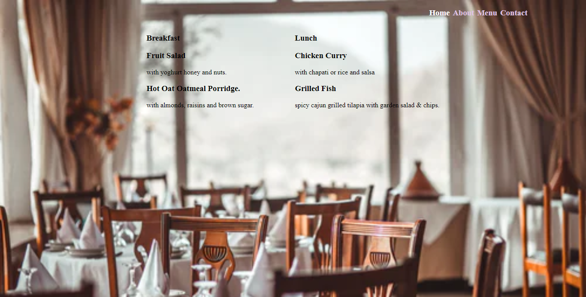

### Restaurant page

## Description
A simple restaurant website which uses javascript alone to generate the entire contents of the website.
The project shows the benefits of modularized code as well as the ability to set up a javascript application made of different modules using webpack.





## Built with

- Javascript
- HTML & CSS
- Webpack

## Live Demo 

[Website link](https://blackpintz.github.io/Restaurant-homepage/)

## Getting Started

To get a local copy up and running follow these simple example steps.

## Prerequisites

- Install node.

## Set up

- Clone the project.
- Cd into the project directory.
- Run ```npm install``` .
- Run ```npm start```.


## Authors

- Github: [@blackpintz](https://github.com/blackpintz)
- Twitter: [@blackpintz](https://twitter.com/blackpintz)


## 🤝 Contributing

Contributions, issues and feature requests are welcome!

Feel free to check the [issues page](https://github.com/blackpintz/Restaurant-homepage/issues).

## Show your support

Give a ⭐️ if you like this project!

## Acknowledgments

- [Microverse](https://www.microverse.org/)


## 📝 License

This project is [MIT](lic.url) licensed.
